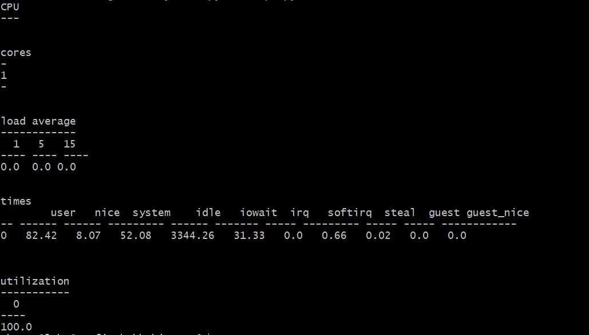
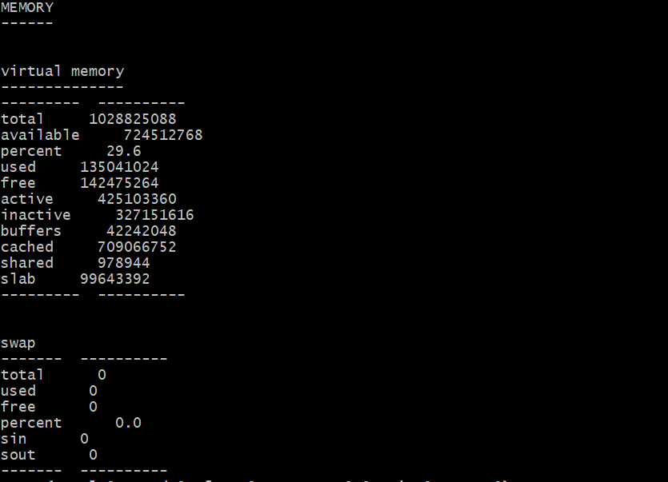

### Server CPU and memory viewer
This is simple cpu and memory viewer script

#### Requirments
- python 3
- ubuntu 20.4
- pip3
- psutil

#### Installations & Configuration
- `sudo apt update`
- `sudo apt install python3-pip`
- `sudo pip3 install -r requirements.txt`

#### Run
- `python3 metrics.py cpu`
- Sample output

    
 

- `python3 metrics.py mem`
- Sample output

    

#### Note!
This script is tested with one core cpu, and graphical results might be different with multiple cpu cores